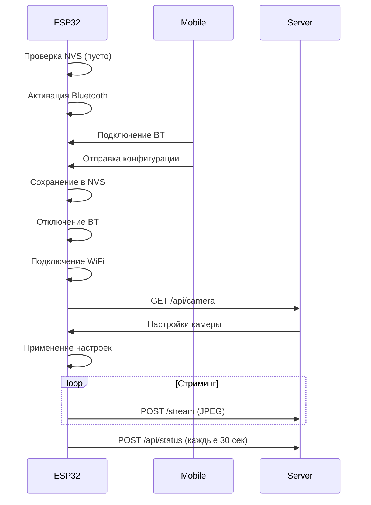
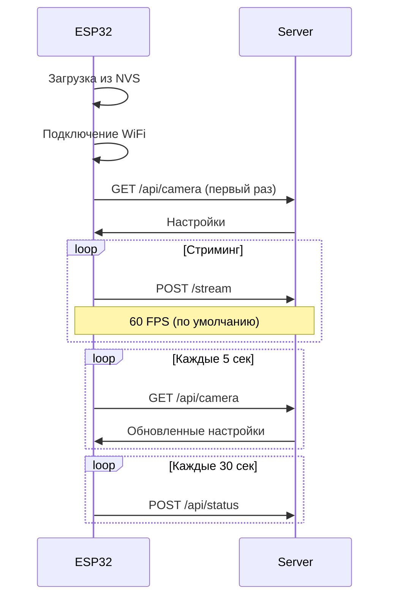
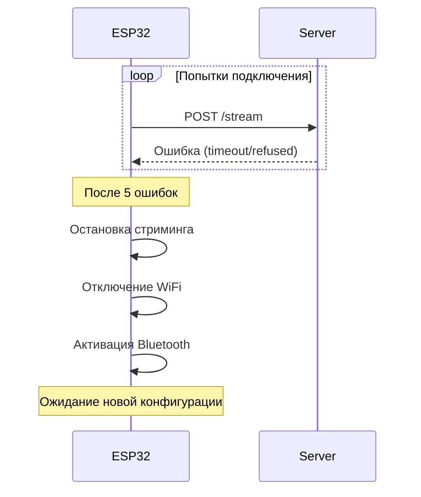

# API Документация

## 📡 HTTP API

ESP32-CAM взаимодействует с веб-сервером через HTTP API. Сервер должен реализовать следующие endpoints.

---

## 📤 Отправка видеопотока

### `POST /stream`

Отправка JPEG кадров на сервер.

#### Request

**Headers**:
```http
POST /stream HTTP/1.1
Host: 192.168.1.100:8081
Content-Type: image/jpeg
Content-Length: 45678
Connection: keep-alive
X-Frame: 1234
```

**Body**: Бинарные данные JPEG изображения

#### Response

**Success (200 OK)**:
```http
HTTP/1.1 200 OK
Content-Length: 0
```

**Error (5xx)**:
```http
HTTP/1.1 500 Internal Server Error
```

#### Особенности

- **Keep-Alive**: Соединение остается открытым между кадрами
- **X-Frame**: Порядковый номер кадра (начинается с 0)
- **Частота**: Зависит от настройки FPS (по умолчанию 60 кадров/сек)

#### Пример сервера (Node.js/Express)

```javascript
app.post('/stream', (req, res) => {
  const frameNumber = req.headers['x-frame'];
  const jpegData = req.body;
  
  // Обработка кадра
  processFrame(frameNumber, jpegData);
  
  res.status(200).send();
});
```

---

## 📥 Получение настроек камеры

### `GET /api/camera`

ESP32-CAM периодически опрашивает этот endpoint (каждые 5 секунд) для получения новых настроек.

#### Request

```http
GET /api/camera HTTP/1.1
Host: 192.168.1.100:8081
```

#### Response

**Success (200 OK)**:
```json
{
  "command": "restart",
  "wifi": {
    "ssid": "NewWiFi",
    "password": "newpassword"
  },
  "bluetooth": {
    "name": "ESP32-CAM-01",
    "enabled": true
  },
  "frameSize": 11,
  "quality": 15,
  "brightness": 0,
  "contrast": 0,
  "saturation": 0,
  "fps": 30,
  "vflip": false,
  "hmirror": false,
  "streaming": true
}
```

**No Changes (304 Not Modified)**:
```http
HTTP/1.1 304 Not Modified
```

#### Параметры

| Параметр | Тип | Описание | Диапазон | По умолчанию |
|----------|-----|----------|----------|--------------|
| `command` | string | Команда управления | "restart" | - |
| `wifi.ssid` | string | SSID WiFi сети | - | - |
| `wifi.password` | string | Пароль WiFi | - | - |
| `bluetooth.name` | string | Имя Bluetooth устройства | - | "ESP32-CAM-Config" |
| `bluetooth.enabled` | boolean | Включить Bluetooth | true/false | true |
| `frameSize` | int | Разрешение камеры | 5-13 | 8 (VGA) |
| `quality` | int | Качество JPEG | 10-63 | 15 |
| `brightness` | int | Яркость | -2 до 2 | 0 |
| `contrast` | int | Контраст | -2 до 2 | 0 |
| `saturation` | int | Насыщенность | -2 до 2 | 0 |
| `fps` | int | Целевой FPS | 1-60 | 60 |
| `vflip` | boolean | Вертикальное отражение | true/false | false |
| `hmirror` | boolean | Горизонтальное отражение | true/false | false |
| `streaming` | boolean | Включить стриминг | true/false | true |

#### Frame Size коды

| Код | Название | Разрешение |
|-----|----------|------------|
| 5 | QVGA | 320x240 |
| 6 | CIF | 400x296 |
| 7 | HVGA | 480x320 |
| 8 | VGA | 640x480 |
| 9 | SVGA | 800x600 |
| 10 | XGA | 1024x768 |
| 11 | HD | 1280x720 |
| 12 | SXGA | 1280x1024 |
| 13 | UXGA | 1600x1200 |

#### Команды

**restart**:
```json
{
  "command": "restart"
}
```
Перезагружает ESP32-CAM.

#### Пример сервера (Node.js/Express)

```javascript
let cameraSettings = {
  frameSize: 11,
  quality: 15,
  fps: 30,
  streaming: true
};

app.get('/api/camera', (req, res) => {
  res.json(cameraSettings);
});

// API для изменения настроек
app.post('/api/camera/settings', (req, res) => {
  cameraSettings = { ...cameraSettings, ...req.body };
  res.json({ success: true });
});
```

---

## 📊 Отправка статуса устройства

### `POST /api/status`

ESP32-CAM отправляет свой статус каждые 30 секунд.

#### Request

**Headers**:
```http
POST /api/status HTTP/1.1
Host: 192.168.1.100:8081
Content-Type: application/json
```

**Body**:
```json
{
  "device_id": "AA:BB:CC:DD:EE:FF",
  "ip": "192.168.1.150",
  "streaming": true,
  "wifi_rssi": -45,
  "uptime": 3600,
  "free_heap": 120456,
  "frames_sent": 108000,
  "frames_failed": 12,
  "camera": {
    "frameSize": 11,
    "quality": 15,
    "brightness": 0,
    "contrast": 0,
    "saturation": 0,
    "fps": 30,
    "vflip": false,
    "hmirror": false
  }
}
```

#### Response

**Success (200 OK)**:
```http
HTTP/1.1 200 OK
Content-Length: 0
```

#### Параметры статуса

| Параметр | Тип | Описание |
|----------|-----|----------|
| `device_id` | string | MAC адрес устройства |
| `ip` | string | IP адрес в сети |
| `streaming` | boolean | Статус стриминга |
| `wifi_rssi` | int | Уровень WiFi сигнала (dBm) |
| `uptime` | int | Время работы (секунды) |
| `free_heap` | int | Свободная память (байты) |
| `frames_sent` | int | Отправлено кадров |
| `frames_failed` | int | Ошибки отправки |
| `camera.*` | object | Текущие настройки камеры |

#### Пример сервера (Node.js/Express)

```javascript
const devices = new Map();

app.post('/api/status', (req, res) => {
  const status = req.body;
  const deviceId = status.device_id;
  
  devices.set(deviceId, {
    ...status,
    lastSeen: Date.now()
  });
  
  console.log(`Device ${deviceId}: ${status.frames_sent} frames, RSSI: ${status.wifi_rssi}`);
  
  res.status(200).send();
});

// API для получения статусов всех устройств
app.get('/api/devices', (req, res) => {
  const deviceList = Array.from(devices.values());
  res.json(deviceList);
});
```

---

## 📱 Bluetooth API

### Конфигурация через Bluetooth Serial

ESP32-CAM принимает настройки через Bluetooth Serial Port Profile (SPP).

#### Подключение

1. Включите Bluetooth на мобильном устройстве
2. Найдите устройство `ESP32-CAM-Config`
3. Подключитесь (без пароля)
4. Откройте Serial terminal

#### JSON формат

```json
{
  "ssid": "YourWiFi",
  "password": "password123",
  "server_host": "192.168.1.100"
}
```

Отправьте JSON с символом новой строки (`\n`) в конце.

#### Простой формат (CSV)

```
YourWiFi,password123,192.168.1.100
```

Формат: `SSID,PASSWORD,SERVER_HOST`  
Отправьте строку с символом новой строки (`\n`) в конце.

#### Ответ

**Успех (JSON формат)**:
```json
{
  "status": "ok",
  "message": "Credentials received"
}
```

**Успех (простой формат)**:
```
OK
```

#### Пример (Python)

```python
import serial
import json

# Подключение к Bluetooth Serial (COM порт зависит от ОС)
ser = serial.Serial('COM5', 9600)

# Отправка настроек
config = {
    "ssid": "MyWiFi",
    "password": "pass123",
    "server_host": "192.168.1.100"
}

ser.write(json.dumps(config).encode() + b'\n')

# Чтение ответа
response = ser.readline().decode().strip()
print(response)

ser.close()
```

#### Пример (Android - BluetoothSerial)

```java
BluetoothSocket socket = device.createRfcommSocketToServiceRecord(uuid);
socket.connect();

OutputStream out = socket.getOutputStream();
String config = "{\"ssid\":\"MyWiFi\",\"password\":\"pass123\",\"server_host\":\"192.168.1.100\"}\n";
out.write(config.getBytes());

InputStream in = socket.getInputStream();
byte[] buffer = new byte[1024];
int bytes = in.read(buffer);
String response = new String(buffer, 0, bytes);
```

---

## 🔄 Последовательность взаимодействия

### Первый запуск



### Обычная работа



### Обработка ошибок



---

## 🧪 Тестирование API

### cURL примеры

**Отправка настроек камеры**:
```bash
curl -X GET http://192.168.1.100:8081/api/camera
```

**Симуляция приема кадра**:
```bash
curl -X POST http://192.168.1.100:8081/stream \
  -H "Content-Type: image/jpeg" \
  -H "X-Frame: 1" \
  --data-binary @test_frame.jpg
```

**Симуляция отправки статуса**:
```bash
curl -X POST http://192.168.1.100:8081/api/status \
  -H "Content-Type: application/json" \
  -d '{
    "device_id": "AA:BB:CC:DD:EE:FF",
    "ip": "192.168.1.150",
    "streaming": true,
    "wifi_rssi": -45,
    "uptime": 3600,
    "free_heap": 120456,
    "frames_sent": 108000,
    "frames_failed": 12
  }'
```

### Postman Collection

Для тестирования API рекомендуется использовать Postman с следующими endpoints:

1. **Get Camera Settings**
   - Method: GET
   - URL: `http://{{server_ip}}:{{port}}/api/camera`

2. **Upload Frame**
   - Method: POST
   - URL: `http://{{server_ip}}:{{port}}/stream`
   - Headers: `Content-Type: image/jpeg`, `X-Frame: 1`
   - Body: Binary (JPEG file)

3. **Send Status**
   - Method: POST
   - URL: `http://{{server_ip}}:{{port}}/api/status`
   - Body: JSON (status object)

---

## 📝 Примечания

- Все HTTP запросы используют timeout 500ms
- Keep-Alive соединение используется для стриминга
- JSON парсинг выполняется с помощью ArduinoJson v7
- Максимальный размер JSON ответа: 4KB
- Bluetooth работает только при отсутствии WiFi соединения
